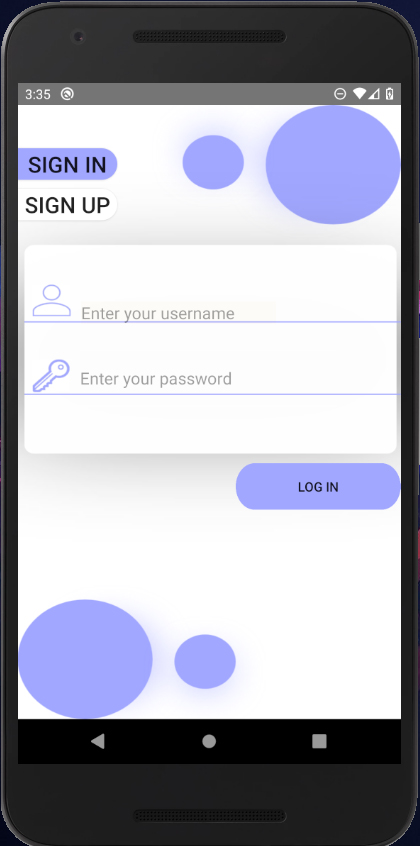
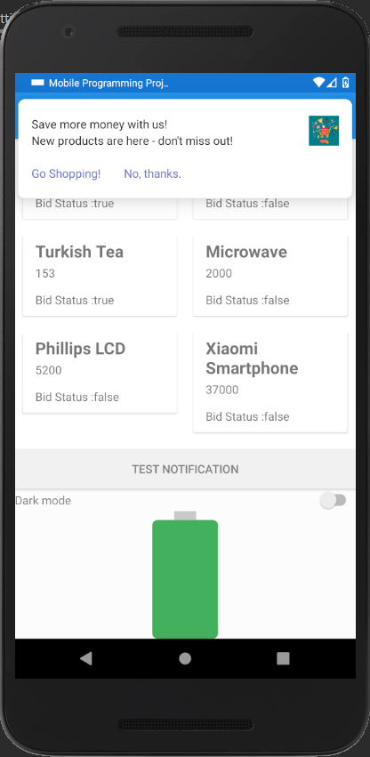
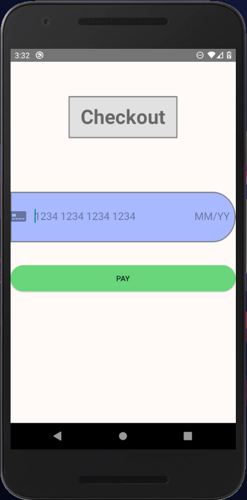
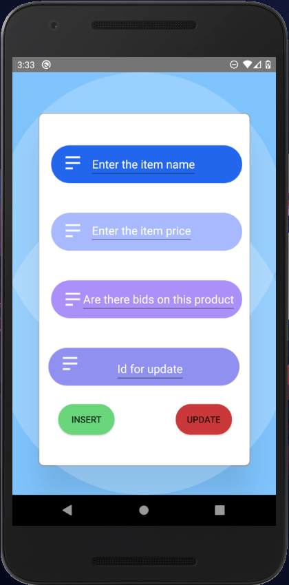

# MobileProgrammingProject
# Project description 📃
A shopping application made in android studio, showcasing all aspects of mobile programming such as:
- `Localisation`
- `Content providers (SQLite)`
- `API usage`
- `Broadcast receivers`
- `Recycler view.`

The application includes an initial sign in or sign up page. The main activity includes a recycler view and a battery icon linked to a braodcast receiver, it lights up when the device is charging. The recycler view is populated by a local database which can be filled with mock data by selecting the "database refresh" option in the overflow menu. The database however, can have new data inserted or have existing data updated by selecting the "insert or update database" option in the overflow menu. Data can also be deleted by clicking an item in the recycler view.

The payment activity uses stripe API to simulate payment. Although, it needs a local instance of the server using maven to run.

The notification can be tested by using the button on the main activity and the background service delivers a notification once every minute.

# Team members 👨‍💻
- [Mohammad Shughri](https://github.com/MohammadShughri)
- [Olamilekan Rasaq Aremu](https://github.com/Areezy)

# Project grade 📝
- 100/100. 
# Screenshots 📸

